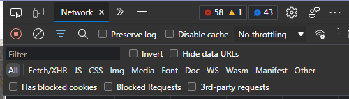
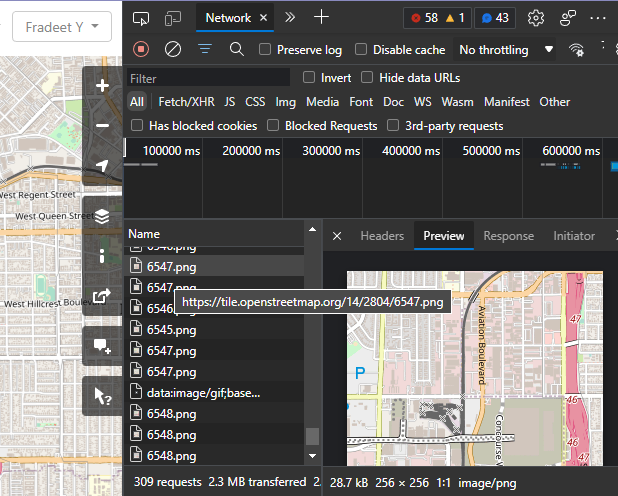
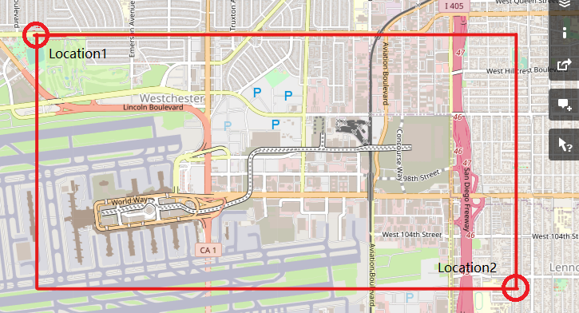
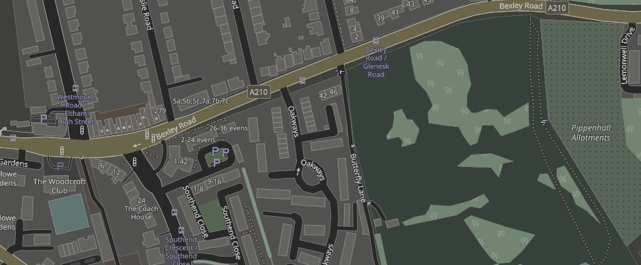

# OSM-tiles-splice-tool
A simple Python script to splice the OpenStreetMap tiles, and can convert tile to dark.

## Features
You can collect the osm server(or host yourself) tiles, and make a big tiles.

## Tutorial
And you need install the Python module first.
```bash
pip install pillow
pip install requests
```
### Basic
Open your web browser, visit [OpenStreetMap Wesite](https://www.openstreetmap.org/), and open the DevTool (Press F12 by default). Turn 'Network' tab, that list the pictures which browser loaded. (If you see the image files, just move the map)


Find the start point what you want, you can choose one and preview the tile. Then look URL, it have 3 numbers, it represents 'Zoom', 'X', 'Y'. Write it down.

> Tips: You also can host the map tiles server, visit [Switch2OSM](https://switch2osm.org/serving-tiles/).

Repeat the above operation, find the end point. The area to be generated is a rectangle ,like below.


Run the script, enter the info.
> **Notice: There have some limit from the official server, visit the [OSM Tiles Usage Policy](https://operations.osmfoundation.org/policies/tiles/)**

### Dark Mode
Inspired by Leaflet CSS render.


## RoadMap
- [x] Update the Dark Mode
- Split the big tiles, easy painting to A4 paper

## About the project
this project was born in my playground. I love map, i want to make a paper-map.
